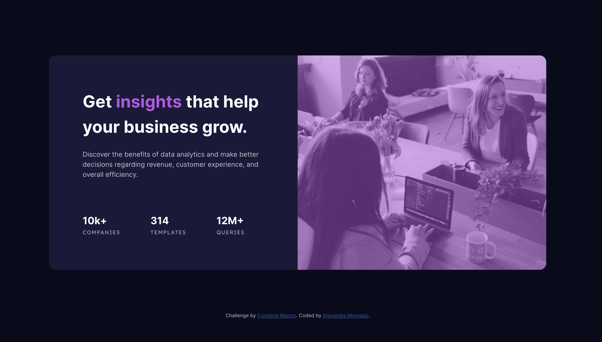

# Frontend Mentor - Stats preview card component solution

This is a solution to the [Stats preview card component challenge on Frontend Mentor](https://www.frontendmentor.io/challenges/stats-preview-card-component-8JqbgoU62). Frontend Mentor challenges help you improve your coding skills by building realistic projects. 

## Table of contents

- [Overview](#overview)
  - [The challenge](#the-challenge)
  - [Screenshot](#screenshot)
  - [Links](#links)
- [My process](#my-process)
  - [Built with](#built-with)
  - [What I learned](#what-i-learned)
  - [Continued development](#continued-development)
  - [Useful resources](#useful-resources)
- [Author](#author)

## Overview

### The challenge

Users should be able to:

- View the optimal layout depending on their device's screen size

### Screenshot



**Note: Delete this note and the paragraphs above when you add your screenshot. If you prefer not to add a screenshot, feel free to remove this entire section.**

### Links

- Solution URL: [https://github.com/Almopt/Stats-Preview-Card-Challenge]
- Live Site URL: [https://almopt.github.io/Stats-Preview-Card-Challenge/]

## My process

Used this project to put in pratice all the content from the 1st part of the Codecademy course related to HTML, CSS, Responsive.

### Built with

- Semantic HTML5 markup
- CSS custom properties
- Flexbox
- CSS Grid

**Note: These are just examples. Delete this note and replace the list above with your own choices**

### What I learned

Learned how to overlay images in CSS

```html
<div class="mobile-img-container">
  <div class="overlay">
  </div>
</div>
```
```css
.mobile-img-container {
  width: 100%;
  height: 100%;
  background-image: url('./images/image-header-mobile.jpg');
  background-position: center;
  background-size: cover;
  background-repeat: no-repeat;
  border-radius: 1em 1em 0 0;
}

.overlay {
  width: 100%;
  height: 100%;
  background-color: rgba(170, 92, 219, 0.5);
  border-radius: 1em 1em 0 0;
}
```

Learned how to hide elements with media queries

```css
  @media only screen and (min-width: 1024px) {

    .mobile-img-container {
      display: none;
    }
  
  }
```

Learned how to use grid-row propertie to change the order of elements inside of a grid

```css
  @media only screen and (min-width: 1024px) {

    .grid-container {
      display: grid;
      grid-template: 1fr / repeat(2, 1fr);
    }

    .info-container {
      padding: 5em;
      text-align: start;
      grid-row: 1 / 2;
    }
  
  }
```
### Continued development

I want to keep challenging myself with more Frontend Mentor Challenges to consolidate all the HTML & CSS properties.

### Useful resources

- [How to Overlay Images with CSS](https://www.w3docs.com/snippets/css/how-to-overlay-images-with-css.html) - This helped me understood how to overlay the images on the challenge.
- [CSS Selectors](https://www.w3schools.com/cssref/css_selectors.php) - This help me understood how to select the first and the last child of an element.
- [How to Hide Elements in a Responsive Layout](https://www.w3docs.com/snippets/css/how-to-hide-elements-in-a-responsive-layout.html) - This help me understood how to hide Elements in Responsive layouts.


**Note: Delete this note and replace the list above with resources that helped you during the challenge. These could come in handy for anyone viewing your solution or for yourself when you look back on this project in the future.**

## Author

- Website - [Alexandre Morgado](https://github.com/Almopt)
- Frontend Mentor - [@Almopt](https://www.frontendmentor.io/profile/Almopt)
- Twitter - [@Almo_pt](https://www.twitter.com/Almo_pt)


